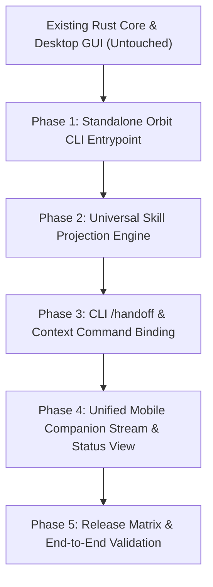

# Orbit: Unified Control Layer & Architecture Integration Plan

> **Core Philosophy**: Orbit is the **Central Brain and Operating/Control Layer around authentic AI CLIs** (Claude, Codex, OpenCode, Antigravity, Gemini, Aider, and custom CLIs). It manages the lifecycle, context, skills, multiplexing, cross-agent handoffs, and remote control.
> 
> **Architectural Invariant**: **Zero Breaking Changes to Existing Architecture**. All existing Rust backend subsystems (`TerminalService`, `alacritty_terminal`, `portable-pty`, `context.rs`, `git.rs`, `storage.rs`), Desktop GUI (`AgentTerminal`, Canvas grid renderer, Zustand stores), and Remote Control protocol remain 100% intact and serve as the foundational engine. The Orbit CLI is an additive interface surface over this exact architecture.

---

```text
                                 ┌─────────────────────────────────────────┐
                                 │            ORBIT FOUNDATION             │
                                 │     Shared Core State & Rust Engine     │
                                 │  (Storage, Git, Context Engine, PTYs)   │
                                 └────────────────────┬────────────────────┘
                                                      │
         ┌────────────────────────────────────────────┼────────────────────────────────────────────┐
         │                                            │                                            │
         ▼                                            ▼                                            ▼
┌─────────────────────────┐              ┌─────────────────────────┐              ┌─────────────────────────┐
│     ORBIT CLI (`orbit`) │              │   ORBIT DESKTOP (GUI)   │              │   ORBIT MOBILE / RELAY  │
│                         │              │                         │              │                         │
│ • Terminal Multiplexer  │              │ • Spatial Agent Canvas  │              │ • Project Status Hub    │
│ • Orbit Command Layer   │              │ • Canvas Grid Renderer  │              │ • Remote Input / PTY    │
│ • Skill Projection      │              │ • Multi-Agent Visualizer│              │ • Handshake & Alerts    │
│ • CLI /handoff & switch │              │ • Context & Handoff UI  │              │ • On-Demand Terminal    │
└────────────┬────────────┘              └────────────┬────────────┘              └────────────┬────────────┘
             │                                        │                                        │
             └────────────────────────────────────────┼────────────────────────────────────────┘
                                                      │
                                                      ▼
                                       ┌─────────────────────────────┐
                                       │   RUST NATIVE TERMINAL      │
                                       │   `src-tauri/src/terminal/` │
                                       │  • `portable-pty` worker    │
                                       │  • `alacritty_terminal`     │
                                       │  • Input arbiter & router   │
                                       │  • Screen snapshots/patches │
                                       └──────────────┬──────────────┘
                                                      │
                       ┌──────────────────────────────┼──────────────────────────────┐
                       │                              │                              │
                       ▼                              ▼                              ▼
                ┌──────────────┐               ┌──────────────┐               ┌──────────────┐
                │ Claude Code  │               │  Codex CLI   │               │   OpenCode   │
                │   REAL PTY   │               │   REAL PTY   │               │   REAL PTY   │
                │ (CLAUDE.md)  │               │ (AGENTS.md)  │               │(skills/rules)│
                └──────────────┘               └──────────────┘               └──────────────┘
```

---

## 1. Preserving Current Architecture: Foundation & Invariants

The existing codebase already contains mature, production-grade subsystems that are preserved without regression:

| Existing Subsystem | Location | Role in Unified Orbit Architecture | Invariant / Preservation Contract |
| :--- | :--- | :--- | :--- |
| **Native Terminal Service** | `src-tauri/src/terminal/` | Allocates PTYs, manages child processes, runs `alacritty_terminal` VT parsing, serializes input, emits screen snapshots. | **UNTOUCHED & REUSED**: The CLI multiplexer and Desktop GUI both attach to the exact same Rust `TerminalSession` instances. |
| **Context & Handoff Engine** | `src-tauri/src/context.rs` | Builds deterministic `ContextPackage` (Git state, diffs, decisions, token estimation, secret redaction). | **UNTOUCHED & REUSED**: Powers both the GUI handoff modal and the CLI `orbit> /handoff` command. |
| **Storage & Workspace State** | `src-tauri/src/storage.rs` | Local JSON persistence at `~/.config/orbit/orbit_state.json`. | **UNTOUCHED & REUSED**: Single source of truth for workspaces, agents, sessions, and handoff history. |
| **Desktop Canvas Renderer** | `src/components/terminal/` | Canvas grid renderer (`TerminalCanvasRenderer.ts`) consuming dirty-row patches & full snapshots. | **PRESERVED**: Desktop spatial canvas continues rendering unmodified. |
| **Universal Remote Controller** | `src/services/remoteControl/` | Headless PTY delivery and remote input bridging for mobile/relay. | **PRESERVED**: InputArbiter and remote boundaries remain 100% stable. |
| **Provider Discovery** | `src-tauri/src/discovery.rs` | Strictly discovers installed CLIs (Claude, Codex, OpenCode, Agy, Kilo, Copilot, etc.). | **PRESERVED**: Used by CLI launcher to list and validate available agents. |

---

## 2. Orbit CLI User Experience (`orbit`)

### 2.1 The Terminal Experience

When launched from any project directory:
```bash
orbit
```

Orbit identifies the project workspace from `orbit_state.json` / current git root and presents the active sessions:

```text
  ORBIT

  Project: OrbitV2

  ┌─────────────────────────────────────────┐
  │  Active Sessions                        │
  │                                         │
  │  1  Claude       frontend-auth ● working│
  │  2  Codex        backend       ● idle   │
  │  3  OpenCode     testing       ● working│
  │                                         │
  │  + Launch new session                   │
  └─────────────────────────────────────────┘

  Select session:
  ❯ Claude — frontend-auth
    Codex — backend
    OpenCode — testing
    Launch new session
```

Selecting an agent attaches directly to the **real running PTY**.

### 2.2 Orbit Command Interceptor vs. Agent Passthrough

Inside an active Orbit session:

```text
orbit> 
```

Orbit's command arbiter splits input deterministically:

1. **Orbit Commands (Intercepted by Orbit)**:
   * `/sessions` $\rightarrow$ List all active sessions and lifecycle statuses.
   * `/new [agent] [name]` $\rightarrow$ Launch a new real CLI in a persistent background PTY.
   * `/switch [name]` $\rightarrow$ Seamlessly detach current view and attach to target PTY.
   * `/skills` / `/skills enable [name]` $\rightarrow$ Manage and project skills into agent-native files.
   * `/context` $\rightarrow$ Display current workspace context, active tasks, and git state.
   * `/handoff [from] [to]` $\rightarrow$ Extract context package and inject into target CLI.
   * `/detach` $\rightarrow$ Detach back to Orbit session picker (agent continues running in background).
   * `/status` $\rightarrow$ Show memory, token estimates, and runtime diagnostics.

2. **Agent Prompts & Native Commands (Direct Passthrough)**:
   * Regular prompts (e.g. `fix the type error in session.rs`) $\rightarrow$ Sent directly to the active CLI's stdin.
   * CLI-native commands (e.g. `/compact`, `/help`, `/review`) $\rightarrow$ Passed through to the underlying CLI untouched.

---

## 3. Universal Skills: Native Projection Engine

Orbit does not force all CLIs to consume skills through a synthetic chat preamble. Instead, Orbit maintains a **Single Source of Truth** for skills and projects them into each tool's native configuration format:

```text
                        ORBIT SKILL REGISTRY
                (~/.config/orbit/skills/ or .orbit/skills/)
                                  │
         ┌────────────────────────┼────────────────────────┐
         ▼                        ▼                        ▼
    Claude Code                 Codex                 OpenCode / Agy
         │                        │                        │
   `CLAUDE.md` /             `AGENTS.md` /            `skills/rules/` /
   `.claude/rules`        `AGENTS-INDEX.md`          `.gemini/rules/`
```

* **Projection Engine**:
  * **Claude Code**: Generates/updates `CLAUDE.md` and `.claude/rules/`.
  * **Codex CLI**: Generates/updates `AGENTS.md` and agent index files.
  * **OpenCode / Antigravity**: Populates native skill rules directories.
  * **Generic CLI Fallback**: Injects initialization preamble on session spawn if no native config file is supported.

---

## 4. Cross-Agent Handoff Engine (`/handoff`)

Leveraging the existing `src-tauri/src/context.rs` engine:

```text
  orbit> /handoff Claude Codex
```

```text
┌─────────────────────────────────────────────────────────┐
│ Handoff: Claude (frontend-auth) ──> Codex (backend)     │
│                                                         │
│ Context Package:                                        │
│   ☑ Active Task & Architecture Decisions                │
│   ☑ Uncommitted Git Diffs (src/auth/, src-tauri/)       │
│   ☑ Modified Files List                                 │
│   ☑ Known Issues & Blocker Summary                      │
│   Token Estimate: ~1,420 tokens                         │
│                                                         │
│ [Enter to Execute Handoff]                              │
└─────────────────────────────────────────────────────────┘
```

1. **Deterministic Extraction**: Generates `ContextPackage` via Rust `context.rs`.
2. **Injection**: Injects the formatted brief directly into Codex's PTY input buffer via `InputArbiter`.
3. **Audit**: Records the transition in `HandoffRecord` within `orbit_state.json`.

---

## 5. Non-Destructive Implementation Roadmap



### Phase 1: Standalone Orbit CLI Entrypoint & Multiplexer
- [ ] Connect CLI entrypoint (`packages/orbit` / `src-tauri/src/bin/orbit.rs` or Bun CLI) directly to Rust `TerminalService`.
- [ ] Implement interactive session picker (`/sessions`, `/switch`, `/new`, `/detach`).
- [ ] Implement raw PTY passthrough with ANSI-clean escape sequence handling.

### Phase 2: Universal Skill Projection Engine
- [ ] Implement skill registry reader (`~/.config/orbit/skills/` and `.orbit/skills/`).
- [ ] Build native file projection modules for `CLAUDE.md`, `AGENTS.md`, and `.gemini/rules/`.
- [ ] Wire `/skills` and `/skills enable <name>` CLI commands.

### Phase 3: CLI /handoff & Context Command Binding
- [ ] Bind `orbit> /handoff` and `orbit> /context` directly to existing Rust `src-tauri/src/context.rs` methods.
- [ ] Implement serialized PTY injection into target agent without restarting the process.
- [ ] Ensure `HandoffRecord` is persisted to `orbit_state.json`.

### Phase 4: Unified Mobile & Relay Integration
- [ ] Expose real-time session status and lightweight event streams to mobile client via existing `UniversalRemoteController`.
- [ ] Keep full terminal rendering local on desktop / CLI; provide on-demand live stream for mobile.

### Phase 5: Verification & Matrix Testing
- [ ] Verify concurrent sessions for Claude, Codex, OpenCode, and Agy with zero PTY interference.
- [ ] Verify zero regressions across the existing Desktop GUI, Canvas grid renderer, and remote control tests.
- [ ] Run full release provider matrix validation (`TERMINAL_RELEASE_VALIDATION.md`).
